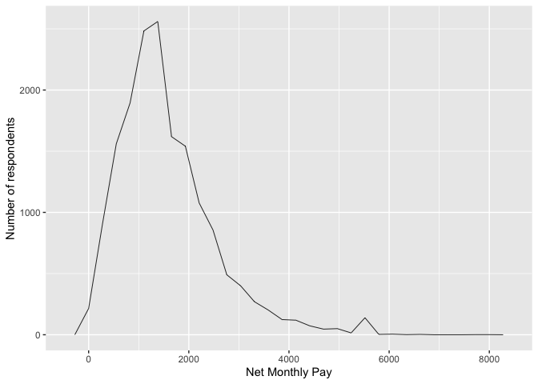
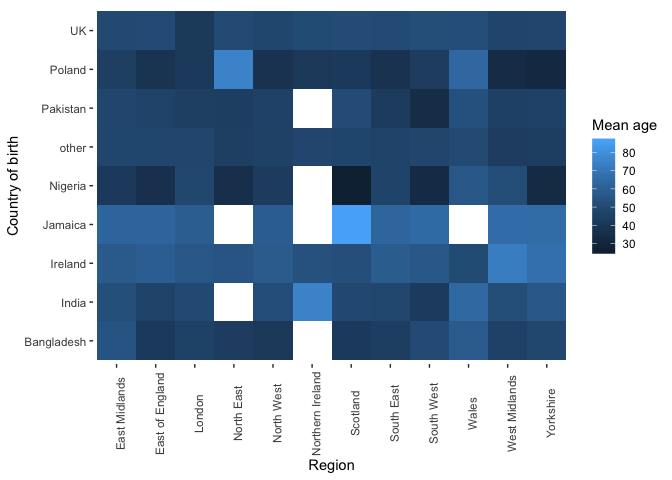
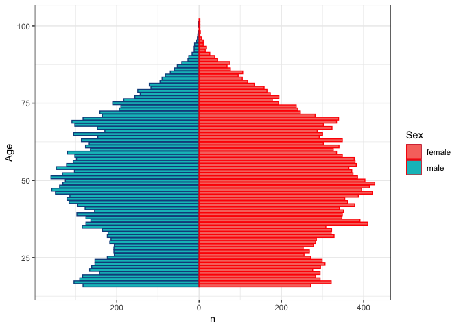

Statistical assignment 4
================
jjm230 124327
28/02/20

In this assignment you will need to reproduce 5 ggplot graphs. I supply graphs as images; you need to write the ggplot2 code to reproduce them and knit and submit a Markdown document with the reproduced graphs (as well as your .Rmd file).

First we will need to open and recode the data. I supply the code for this; you only need to change the file paths.

``` r
library(tidyverse)
Data8 <- read_tsv("~/Documents/Exeter/Q-Step/POL2094 Data Analysis in Social Science III/Data III Project/Data III Project/data/UKDA-6614-tab/tab/ukhls_w8/h_indresp.tab")
Data8 <- Data8 %>%
        select(pidp, h_age_dv, h_payn_dv, h_gor_dv)
Stable <- read_tsv("~/Documents/Exeter/Q-Step/POL2094 Data Analysis in Social Science III/Data III Project/Data III Project/data/UKDA-6614-tab/tab/ukhls_wx/xwavedat.tab")
Stable <- Stable %>%
        select(pidp, sex_dv, ukborn, plbornc)
Data <- Data8 %>% left_join(Stable, "pidp")
rm(Data8, Stable)
Data <- Data %>%
        mutate(sex_dv = ifelse(sex_dv == 1, "male",
                           ifelse(sex_dv == 2, "female", NA))) %>%
        mutate(h_payn_dv = ifelse(h_payn_dv < 0, NA, h_payn_dv)) %>%
        mutate(h_gor_dv = recode(h_gor_dv,
                         `-9` = NA_character_,
                         `1` = "North East",
                         `2` = "North West",
                         `3` = "Yorkshire",
                         `4` = "East Midlands",
                         `5` = "West Midlands",
                         `6` = "East of England",
                         `7` = "London",
                         `8` = "South East",
                         `9` = "South West",
                         `10` = "Wales",
                         `11` = "Scotland",
                         `12` = "Northern Ireland")) %>%
        mutate(placeBorn = case_when(
                ukborn  == -9 ~ NA_character_,
                ukborn < 5 ~ "UK",
                plbornc == 5 ~ "Ireland",
                plbornc == 18 ~ "India",
                plbornc == 19 ~ "Pakistan",
                plbornc == 20 ~ "Bangladesh",
                plbornc == 10 ~ "Poland",
                plbornc == 27 ~ "Jamaica",
                plbornc == 24 ~ "Nigeria",
                TRUE ~ "other")
        )
```

Reproduce the following graphs as close as you can. For each graph, write two sentences (not more!) describing its main message.

1.  Univariate distribution (20 points).

``` r
Data %>%
  ggplot(Data, mapping = aes(x = h_payn_dv)) +
    geom_freqpoly(size = 0.3) + 
    labs(x = "Net Monthly Pay",
         y = "Number of respondents")
```

 Interpretation: The majority of respondents earn less than £2,000 per month, and respondents decrease exponentially as earnings increase. There is a small spike in respondents around £5,500 per month, however it is unclear from this graph why that might be the case.

1.  Line chart (20 points). The lines show the non-parametric association between age and monthly earnings for men and women.

``` r
byAgeSex <- Data %>%
  filter(!is.na(h_payn_dv)) %>%
  mutate(Sex = sex_dv) %>%
  group_by(h_age_dv, Sex) %>%
  summarise(meanIncome = mean(h_payn_dv, na.rm = TRUE))
ggplot(byAgeSex, mapping = aes(x = h_age_dv, y = meanIncome, group = Sex)) +
  geom_smooth(aes(linetype = Sex), colour = "black") +
  xlim(16, 65) +
  labs(x = "Age",
       y = "Monthly earnings")
```

 Interpretation: Men consistently earn more than women over the course of their entire working lives. However, the trajectories of both men and women remain the same, peaking in the early 40s and steadily decreasing thereafter.

1.  Faceted bar chart (20 points).

``` r
byOriginSex <- Data %>%
  filter(!is.na(h_payn_dv)) %>%
  filter(!is.na(placeBorn)) %>%
  group_by(placeBorn, sex_dv) %>%
  summarise(medianIncome = median(h_payn_dv, na.rm = TRUE))
ggplot(byOriginSex, mapping = aes(x = sex_dv, y = medianIncome)) + 
  geom_bar(stat = "identity") + 
  facet_wrap(~ placeBorn) +
  labs(x = "Sex", 
       y = "Median monthly net pay")
```

 Interpretation: The graph supports the previous observation that men consistently make more money (net monthly) than women, demonstrating that it holds across country of birth as well. It also shows that the place of birth generally has only a small influence on income, with most countries centered around ~£1,500, with the exceptions of Pakistan and Bangladesh that see consistently less.

1.  Heat map (20 points).

``` r
byOriginRegion <- Data %>%
  filter(!is.na(h_gor_dv)) %>%
  filter(!is.na(placeBorn)) %>%
  group_by(h_gor_dv, placeBorn) %>%
  summarise(meanAge = mean(h_age_dv, na.rm = TRUE))
ggplot(byOriginRegion, mapping = aes(x = h_gor_dv, y = placeBorn, fill = meanAge)) +
  geom_tile() + 
  labs(x = "Region", 
       y = "Country of birth",
       fill = "Mean age") +
  theme(panel.background = element_blank()) +
  theme(axis.text.x = element_text(angle = 90))
```

 Interpretation: People born in a given country tend to have a similar average age regardless of region lived in, which may be expected as it is well documented how immigrants into the UK normally arrive in grouped 'waves'. However, certain regions have distictly younger (e.g. London) or older (e.g. Wales) populations, probably explained by contrasting employment opportunities. (N.b. darker tiles represent younger mean ages.)

1.  Population pyramid (20 points).

``` r
byAgeSex2 <- Data %>%
  filter(!is.na(sex_dv)) %>%
  group_by(h_age_dv, sex_dv) %>%
  count(h_age_dv, sex_dv)
byAgeSex2$n <- ifelse(byAgeSex2$sex_dv == "male", -1*byAgeSex2$n, byAgeSex2$n)
ggplot(byAgeSex2, mapping = aes(x = h_age_dv, y = n, fill = sex_dv)) +
         geom_bar(data = subset(byAgeSex2, sex_dv == "male"), stat = "identity", colour = "dodgerblue4") +
         geom_bar(data = subset(byAgeSex2, sex_dv == "female"), stat = "identity", colour = "red") +
         coord_flip() +
         scale_y_continuous(breaks = seq(-400, 500, 200),                                            # N.b. this line deviates from the set graph but successfully changes the male age count to positive, which was encouraged.
                            labels = paste(as.character(c(400, 200, 0, 200, 400)))) +
         labs(x = "Age",
              fill = "Sex") +
         theme_bw()
```

 Interpretation: The population pyramid shows an ageing population due to increased median age and decreased fertility within the UK, with the typical ageing 'bump' observed approximately between the ages of 40 and 65. There are slighly more women than men across most ages, with this difference becoming more pronounced at older ages due to women's slightly increased life expectancy.
